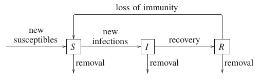
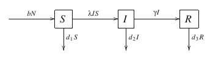
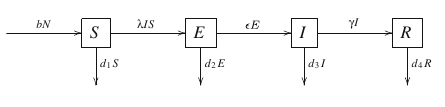
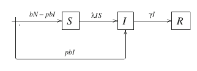
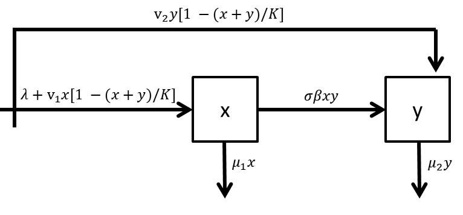
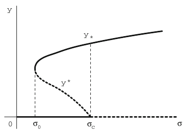

```{r setup, include=FALSE}
knitr::opts_chunk$set(echo = TRUE, fig.align = "center", comment = NA, message = F)
```

# Introducción

El objetivo de este trabajo es implementar en R el **modelo compartimental in-host para infecciones virales en una población celular** y crear una **aplicación Shiny** ([*Shiny Apps*](http://shiny.rstudio.com/)) que permita simular el comportamiento del proceso de transimisión del virus bajo distintos escenarios para los parámetros. De esta manera, se pretende no sólo mostrar el código necesario para correr el modelo en R si no proveer una interfaz interactiva para analizar la evolución y estabilidad del proceso generado. Ante cada selección de valores de interés de los parámetros del modelo, se debe hacer click en *Correr modelo* para luego explorar las distintas pestañas de la aplicación.

Este trabajo se sostiene sobre las siguientes herramientas:

- **El libro de Michael Li, An Introduction To Math Modeling of Infectious Diseases** (Springer, 2018). La sección 5.2 del cápitulo *Tópicos especiales* presenta en detalle el modelo estudiado y a partir de los resultados derivados en este texto se compone el análisis de la estabilidad y dinámica global del modelo presentado en la primera parte de la pestaña *Análisis*.

- **El paquete de R EpiModel**. El modelo in-host se presenta como un caso particular de un modelo compartimental epidemiológico *SI* para el estudio de la diseminación de enfermedades infecciosas. Por lo tanto, se hace uso del paquete [**EpiModel**](http://cran.r-project.org/web/packages/EpiModel/index.html), que provee un conjunto de herramientas análiticas y gráficas para el estudio de modelos de este tipo y en base a algunas de las cuales se programaron los resultados de las pestañas *Gráficos*, *Resumen* y *Datos*. Si bien el paquete incluye una variedad de modelos predefinidos, fue necesario crear un nuevo tipo de modelo personalizado para poder estudiar al modelo in-host en función de los parámetros biológicos que lo definen. Los autores del paquete también han puesto a disposición una *Shiny App* para estudiar distintos modelos, que sirvió de inspiración para este trabajo, pero que no hubiese permitido estudiar las particularidades del modelo in-host.

- **El paquete de R** [**phaseR**](https://cran.r-project.org/web/packages/phaseR/vignettes/my-vignette.html). Este paquete permite estudiar sistemas de ecuaciones diferenciales en R, facilitando la construcción del plano de fases, el hallazgo y clasificación de puntos de equilibrio, entre otras. Se programó para automatizar el uso de las herramientas de este paquete de manera de poder analizar matemáticamente las características del proceso de manera general a partir del sistema de ecuaciones impuesto por el modelo in-host, más allá de lo deducido particularmente en el texto de Li. Estos resultados, junto con el plano de fases, se presentan en la segunda parte de la pestaña *Análisis*.

En la siguiente sección se presentan de manera general general los *modelos matemáticos compartimentales para el estudio de procesos infecciosos* y en la última sección se comentan las características particulares del *modelo in-host* para el estudio de infecciones por el virus HTLV-I en células T CD4+.

Los valores por default con los que se inicia la aplicación al ejecutarse corresponden a los empleados en la simulación presentada en la figura 5.5 (a) del libro de Li (página 149).

# Modelización Matemática de Enfermedades Infecciosas

Una enfermedad es *infecciosa* si el agente causante, por ejemplo, un virus o bacteria, puede ser transmitido de un individuo a otro a través del algún medio como puede ser contacto físico directo, gotas de la vía respiratoria transportadas en el aire, agua, comida, vectores o de madre a recién nacido.

El objetivo de la modelización matemática de una enfermedad infecciosa es describir el *proceso de transmisión* de la enfermedad, que generalmente se describe de la siguiente forma: cuando individuos infectados son introducidos en una población susceptible, la enfermedad se pasa a otros individuos a través de sus modos de transmisión, expandiéndose en la población. Un individuo puede ser asintomático durante una etapa temprana de la infección, para ser diagnosticado como un *caso* más tarde, luego de la aparición de los síntomas. Individuos infectados pueden o no recuperarse, ya sea por tratamiento o como respuesta de su sistema inmune, y pueden ganar cierto grado de inmunidad contra una posible re infección.
Dependiendo de los alcances y velocidad de la expansión y los mecanismos de recuperación e inmunización, una infección puede dar lugar a un *brote de la enfermedad*, una *epidemia*, una *endemia* o una *pandemia*.

Los modelos matemáticos han sido capaces de proveer claridad sobre los procesos de transmisión y expansión, ayudando a identificar factores claves para el control de la transimisión y prevención y a estimar la severidad y escala potencial de la infección en una población. El proceso de la modelización involucra tres etapas generales: (1) realizar supuestos sobre el proceso de transmisión basados en conocimiento biológico o médico, (2) definir modelos matemáticos en base a esos supuestos, (3) realizar análisis matemáticos sobre los modelos e interpretar los hallazgos. Siempre que fuere posible, se debe validar a través de datos los supuestos y validez de los modelos.

## Enfoque compartimental

Un enfoque muy utilizado para modelar un proceso infeccioso requiere particionar la población bajo estudio en grupos mutuamente exclusivos (los **compartimentos**), de acuerdo a las características de la enfermedad. Por ejemplo:

- **S**: individuos susceptibles
- **I**: individuos infectados
- **R**: individuos recuperados

Los movimientos de los individuos entre estos grupos puede ser representado en un **diagrama de transmisión**:

```{r, out.width='70%', fig.cap='Diagrama de transmisión', echo=FALSE}

```

El objetivo de la modelización es llevar registro de las cantidades de individuos en cada compartimento en cualquier momento $t$, denotadas $S(t)$, $I(t)$ y $R(t)$. Se establece un pequeño intervalo de tiempo $[t, t+\Delta t]$ para evaluar los cambios en dichas cantidades. Estas variaciones pueden calcularse como:

- $\Delta S(t)$ = nuevos susceptibles + ingresos desde R - nuevas infecciones - egresos desde S
- $\Delta I(t)$ = nuevos infectados (desde S) - egresos hacia R - egresos desde I
- $\Delta R(t)$ = ingresos desde I - egresos hacia S - egresos desde R

Si dividimos ambos miembros de las anteriores igualdades por $\Delta t$ y hacemos tender $\Delta t$ a 0, entonces la parte izquierda se convierte en las derivadas $S'(t)$, $I'(t)$ y $R'(t)$, ya que, tomando de ejemplo el compartimento de *susceptibles*:

$$
\frac{\Delta S(t)}{\Delta t} = \frac{S(t+\Delta t) - S(t)}{\Delta t} \rightarrow S'(t) \quad \text{cuando} \quad \Delta t \rightarrow 0
$$

De esta forma, los términos de la derecha se convierten en tasas instantáneas de incidencia, recuperación, ingreso o egreso:

- $S'(t)$ = flujo de nuevos susceptibles + tasa de transferencia desde R - incidencia - tasa de remoción desde S
- $I'(t)$ = incidencia - tasa de transferencia hacia R - tasa de remoción desde I
- $R'(t)$ = tasa de transferencia desde I - tasa de transferencia hacia S - tasa de remoción desde R

Si expresamos todos los términos en los miembros derechos como funciones de $S(t)$, $I(t)$ y $R(t)$, se obtiene un **sistema de ecuaciones diferenciales** que dan lugar a una familia de modelos matemáticos conocidos como **SIR**. Se debe destacar que el mismo se basa en las hipótesis establecidadas sobre el proceso biológico de transmisión de la enfermedad y las transferencias entre los distintos compartimentos. Diferentes hipótesis o supuestos pueden dar lugar a diferentes formas del modelo y, por lo tanto, a distintos resultados. Si hay datos disponibles, se pueden utilizar para validar el conjunto de hipótesis hechas.

## Otros comentarios sobre modelos bajo el enfoque compartimental

Para describir los movimientos poblacionales, se deben establecer supuestos sobre las tasas de transferencias entre compartimentos. Por ejemplo:

- Tasa de recuperación (o tasa de transferencia de $I$ a $R$): $\gamma I$
- Tasa de transferencia de $R$ a $S$: $\delta R$, pensando en que los individuos recuperados tienen cierto período de inmunidad.
- Incidencia (número de nuevas infecciones por unidad de tiempo): $\beta I S$, llamada **incidencia bilineal**. Se basa en el supuesto de que la mezcla o intercambio entre individuos es homogéneo y por lo tanto aplica la *Ley de la acción de masas*: el número de contacto depende del número de individuos en cada compartimento. $\beta$ recibe el nombre de **coeficiente de transmisión**.
- Tasas de nacimiento, muerte, inmigración y emigración para modelar el crecimiento de la población.

```{r, out.width='70%', fig.cap='Ejemplo de un diagrama de transmisión con tasas constantes', echo=FALSE}

```

En los ejemplo anteriores, se tomó un supuesto sencillo: las tasas transferencia entre compartimentos son constantes. Esto sería sólo una de las tantas hipótesis que se podrían plantear.

Para algunas enfermedades en las cuales se da un periodo de latencia entre la infección y la manifestación de los síntomas, se puede pensar en una modificación del modelo como lo muestra la siguiente figura. El compartimento de los infectados se separa en dos, el **compartimento latente** $E$ y el infeccioso $I$, y se puede también asumir que la transferencia de $E$ a $I$ es proprocional al tamaño de $E$, $\epsilon E$:

```{r, out.width='70%', fig.cap='Diagrama para un modelo con periodo de latencia', echo=FALSE}

```

Cuando la transmisión ocurre por contacto directo entre individuos infectados y susceptibles se dice que la transmisión en **horizontal**. Sin embargo, pueden existir otros medios, como la **transmisión vertical**, cuando los patógenos pasan a un recién nacido directamente de un progenitor infectado. El siguiente diagrama muestra un modelo para una enfermedad con transmisión tanto horizontal como vertical:

```{r, out.width='70%', fig.cap='Diagrama para un modelo con transmisión horizontal y vertical', echo=FALSE}

```

## El número básico de reproducción

El **número básico de reproducción** $\mathbf{R}_0$ es probablemente el parámetro más importante de la modelización epidémica. Mide el número promedio de infecciones secundarias causadas por un único individuo infectado en una población enteramente susceptible durante un período infeccioso medio. Si $\mathbf{R}_0 < 1$, entonces no habrá epidemia, mientras que si $\mathbf{R}_0 > 1$, sí la habrá.

Para algunos modelos sencillos, $\mathbf{R}_0$ puede deducirse a partir del diagrama de transmisión, mientras que en otros casos se puede obtener en base al análisis de la estabilidad de los puntos de equilibrio libres de enfermedad que presente el sistema.

# Modelo in-host para infecciones por HTLV-I en células T CD4+

En la sección anterior se ha presentado cómo se pueden emplear modelos matemáticos para describir la transmisión de una enfermedad en la escala de una epidemia. En esta sección se muestra que el mismo tipo de enfoque puede aplicarse para describir procesos infecciosos a nivel microscópico, como la diseminación de una infección viral en una población de células. Los modelos resultantes se conocen como **in-host** (en el hospedador). A pesar de que los modelos in-host se orientan a procesos que tienen una escala muy diferente a los modelos epidemiológicos, se llegan a ecuaciones diferenciales muy similares, lo cual permite aplicar en este caso particular la estructura de los modelos antes descriptos.

## Infección de células T por el virus HTLV-I

En la sección 5.2 de su libro, Li ejemplifica esta aplicación de los modelos para enfermedades infecciosas a nivel celular con el análisis de la infección de células T CD4+ por el virus HTLV-I, responsable de varias enfermedades como linfoma/leucemia en adultos (LTA) y mielopatia asociada a htlv-1 (MAH). 

Este agente es un retrovirus que como tal emplea una proteina viral para sintetizar segmentos de ADN (provirus) que se integran al ADN de la célula hospedadora y su población objetivo son los T-linfocitos CD4+. Fuera de la célula, el virus no genera infección y generalmente se requiere contacto célula a célula para la misma. Además, se transmite verticalmente a células hijas durante la división mitótica.

## Definición del modelo y supuestos biológicos

Para modelar la infección por HTLV-I, se particiona a la población de células T CD4+ en dos compartimentos, no infectadas e infectadas, siendo $x(t)$ e $y(t)$ sus respectivas cantidades. Se asume que:

- El crecimiento por mitosis de la población de células no infectadas obedece la ley de crecimiento logístico y está descripto por $v_1 x(t) [1 - (x(t) + y(t)) / K]$, donde $v_1$ es una tasa de crecimiento constante y $K$ es el nivel de células T CD4+ en cual se detiene la división mitótica.
- Las células infectadas mantienen la mayor parte de sus funciones celulares y su división es similar a la de las no infectadas, con una tasa de crecimiento constante igual a $v_2$: $v_2 y(t) [1 - (x(t) + y(t)) / K]$.
- La transmisión horizontal ocurre por contacto célula a célula entre infectadas y no infectadas. Dado que se modela el proceso en sangre periférica donde las células están lo suficientemente mezcladas, se asume una incidencia bilinial de la forma $\beta x(t) y(t)$, donde $\beta$ es el *coeficiente de transmisión*.
- Las células recién infectadas enfrentan una fuerte respuesta inmune por anticuerpos y linfocitos citotóxicos, por lo que sólo una fracción $\sigma$ de las mismas resiste las reacciones del sistema inmune y permanece infectada ($0 \leq \sigma << 1$).
- El cuerpo genera células T CD4+ a una tasa constante $\lambda$ y las nuevas células son no infectadas.
- La tasa de remoción de células T CD4+ no infectadas es una constante $\mu_1$ e incluye pérdida por muerte natural u otras causas.
- La tasa de remoción de células T CD4+ infectadas es una constante $\mu_2$ e incluye pérdida por muerte natural y respuestas inmunes.

\begin{equation} 
  x' = \lambda + v_1 x \Big(1 - \frac{x + y}{K}\Big) - \mu_1 x - \beta x y \\
  y' = \sigma \beta x y + v_2 y \Big(1 - \frac{x + y}{K}\Big) - \mu_2 y
  (\#eq:5-11)
\end{equation} 

Lo anterior se puede representar de la siguiente forma:

```{r, out.width='70%', fig.cap='Diagrama de transmisión', echo=FALSE}

```

## Puntos de equilibrio y bifurcación

Los puntos de equilibrio del sistema \@ref(eq:5-11) satisfacen

\begin{equation} 
  0 = \lambda + v_1 x \Big(1 - \frac{x + y}{K}\Big) - \mu_1 x - \beta x y \\
  0 = \sigma \beta x y + v_2 y \Big(1 - \frac{x + y}{K}\Big) - \mu_2 y
  (\#eq:5-13)
\end{equation} 

Considerando que las soluciones de interés de \@ref(eq:5-11) pertenecen a $\mathbf{R}^2_+$, se pueden definir dos tipos de puntos de equilibrio:

- **Equilibrio libre de infección**, $P_0 = (x_0, 0)$ que existe para cualquier valor de los parámetros, siendo $x_0 > 0$ la raiz positiva del polinomio

    \begin{equation} 
      f_1(x) = \lambda + (v_1 - \mu_1) x - \frac{v_1}{K} x^2
      (\#eq:5-14)
    \end{equation} 

- **Equilibrio con infección crónica**, $\bar P = (\bar x, \bar y)$, con $\bar y > 0$. De la segunda ecuación \@ref(eq:5-13) se obtiene:

    \begin{equation} 
      \bar y = \frac{K}{v_2} \Big[ \big( \sigma \beta - \frac{v_2}{K} \big) \bar x + (v_2 - \mu_2) \Big]
      (\#eq:5-15)
    \end{equation} 
    
    y $\bar x$ es tal que satisface $f_1(\bar x) = f_2(\bar x)$, donde $f_1$ fue definida en \@ref(eq:5-14) y 
    
    \begin{equation} 
      f_2(x) = \frac{1}{v_2} \Big( \frac{v_1}{K} + \beta \Big) \Big[ (\sigma K \beta - v_2) x + K (v_2 - \mu_2) \Big] x
      (\#eq:5-16)
    \end{equation} 
    
El número de puntos de equilibrio puede analizarse examinando las intersecciones en los gráficos de $f_1$ y $f_2$. Hay más de uno si $f_2$ es cóncava hacia abajo y tiene una raiz positiva, lo cual sucede si y sólo si:

\begin{equation} 
  \sigma K \beta < v_2 \text{  y  } \mu_2 < v_2
  (\#eq:5-17)
\end{equation} 

Para asegurar que las gráficas de $f_1$ y $f_2$ se crucen se debe verificar:

\begin{equation} 
  (v_1 + \beta K)^2 \Big(1 - \frac{\mu_2}{v_2} \Big)^2 > (v_1 - \mu_1)^2 + 4 \lambda \frac{v_1}{K}
  (\#eq:5-18)
\end{equation}

Para analizar la cantidad de puntos de equilibrio con infección crónica se define:

\begin{equation} 
  \sigma_0 = \frac{4 \lambda \beta v_2^2 - \big[ (v_1 - \mu_1) v_2 - (v_1 + K \beta) (v_2 - \mu_2) \big]^2}{4 \lambda \beta v_2 (v_1 + K \beta)}
  (\#eq:5-19)
\end{equation}

y

\begin{equation} 
  \sigma_c = \frac{v_2}{K \beta} - \frac{(v_2 - \mu_2)}{\beta x_0}
  (\#eq:5-20)
\end{equation}

y a partir de su análisis se demuestra que, si se cumplen \@ref(eq:5-17) y \@ref(eq:5-18):

1. Si $0 < \sigma < \sigma_0$, $f_1$ y $f_2$ no se cruzan y **no hay punto de equilibrio con infección crónica**.
2. Si $\sigma = \sigma_0$ $f_1$ y $f_2$ son tangentes y **hay un único punto con infección crónica**.
3. Si $\sigma_0 < \sigma < \sigma_c$, hay dos cruces de $f_1$ y $f_2$ en el primer cuadrante y **hay dos puntos de equilibrio con infección crónica**.
4. Si $\sigma \geq \sigma_c$, hay sólo un cruce de $f_1$ y $f_2$ en el primer cuadrante y **hay sólo un punto de equilibrio con infección crónica** en la región factible.

Se dice que se produce una **bifurcación** cuando cambia el número de puntos de equilibrios de un sistema ante el cambio en los parámetros. Se representa gráficamente a través de un *diagrama de bifurcación*, donde el eje horizontal muestra la variación en el parámetro que produce la bifurcación, el eje vertical el número de infectados, un punto de equilibrio estable se representa con una línea sólida y uno inestable con una línea punteada:

```{r, out.width='70%', fig.cap='Diagrama de bifurcación', echo=FALSE}

```

## El número básico de reproducción

De manera análoga a la definición general, aquí $\mathbf{R}_0$ se define como el promedio de infecciones secundarias causadas por una sola célula T CD4+ infectada introducida en una población enteramente susceptible sobre el periodo completo de infección $1/\mu_2$. Para el modelo \@ref(eq:5-11), está dado por:

\begin{equation} 
  \mathbf{R}_0 = \mathbf{R}_0(\sigma) = \frac{1}{\mu_2} \Big[ \sigma \beta x_0 + v_2 \Big( 1 - \frac{x_0}{K} \Big) \Big]
  (\#eq:5-21)
\end{equation}

El primer término en los corchetes describe las infecciones secundarias por unidad de tiempo por contacto célula a célcula y el segundo término por división mitótica.

Por la relación de $\mathbf{R}_0$ con el parámetro $\sigma$ y en función del diagrama de bifurcación, se concluye que este proceso presenta una **bifurcación hacia atrás** (*backward bifurcation*), que presenta un comportamiento *catastrófico*:

- Cuando $\mathbf{R}_0$ aumenta por encima de 1, se produce un salto en el nùmero de células infectadas, pudiendo resultar en una explosión de la población de células infectadas.
- Cuando $\mathbf{R}_0$ decrece por debajo de 1, el nivel de infección crónica permanece alto, en contraste con el comportamiento estándar de los modelos epidémicos como se describió en la sección 2.3.

## Estabilidad de los puntos de equilibrio

El análisis de los puntos de equilibrio a partir de las matrices jacobianas permite concluir que:

1. El punto de equilibrio libre de infección $P_0 = (x_0, 0)$ es localmente estable asintóticamente si $\mathbf{R}_0(\sigma) < 1$ y es inestable si $\mathbf{R}_0(\sigma) > 1$.
2. Si $\sigma_0 < \sigma < \sigma_c$, uno de los puntos de equilibrio con infección crónica es localmente estable asintóticamente y el otro un punto de silla.
3. Si $\sigma : \sigma_c$, el único punto de equilibrio con infección crónica es localmente estable asintóticamente.

Si se verifican \@ref(eq:5-17) y \@ref(eq:5-18), la dinámica global del sistema está caracterizada por:

1. Si $0 < \mathbf{R}_0 < \mathbf{R}_0(\sigma_0)$, el punto de equilibrio libre de infección $P_0$ es globalmente estable asintóticamente.
2. Si $\mathbf{R}_0(\sigma_0) < \mathbf{R}_0 < 1$ el sistema tiene dos puntos de atracción, el punto de equilibrio libre de infección $P_0$ y uno de infección crónica, y otro punto infección crónica que es un punto de silla.
3. Si $\mathbf{R}_0 > 1$, el único punto de equilibrio con infección crónica es globalmente estable asintóticamente.

Como se puede ver en el diagrama de bifurcación, el modelo atraviesa una bifurcación hacia atrás a medida que $\sigma$ aumenta, es decir, un punto de equilibrio estable con infección existe aún cuando el número básico de reproducción $\mathbf{R}_0(\sigma)$ es menor que 1 para un gran rango de valores del parámetro. Esto hace que la dinámica global presente dos puntos de atracción, con y sin infección, cuyo estado final dependerá de las condiciones iniciales.

## Simulaciones

Li asigna valores a los parámetros que definen el modelo en base a la interpretación de los mismos descripta anteriormente y teniendo en cuenta el siguiente conocimiento biológico tomado de la literatura científica:

- La fracción $\sigma$ de células infectadas que sobreviven al ataque del sistema inmune es muy pequeño, como lo sugiere la gran estabilidad genética del virus.
- La tasa de división mitótica debe ser alta ($v_2 > \mu_2$).
- El cuerpo humano genera células T CD4+ a una tasa de $\lambda = 25$ células/$mm^3$.
- La tasa natural de muerte es $\mu_1 \approx \mu_2 \approx 0.03 \text{ días}^{-1}$.
- En ausencia de infección, el número de células se espera que sea constante con valor normal alrededor de $1000/mm^3$ y una capacidad de carga constante igual a $K = 1150/mm^3$. Esto implica fijar $x_0 \approx 1000/mm^3$, es decir, $f_1(1000) \approx 0$, de lo cual se deduce una proliferación constante de $v_2 \approx v_1 \approx 0.038 \text{ día}^{-1}$.
- $\beta \approx 1.03 \times 10^{-3} mm^3/$célula/día.

En la Figura 5.5, el autor presenta el resultado de 3 escenarios, para mostrar cómo el destino de la infección depende de la condición inicial. Los tres paneles de la figura pueden reproducirse en esta aplicación con los valores de los parámetros presentados arriba y:

- **Panel a**: $\sigma = 0.015$, $y_0 = 50$ (presentado en los valores default cuando se ejecuta la aplicación)
- **Panel b**: $\sigma = 0.015$, $y_0 = 300$
- **Panel c**: $\sigma = 0.03$, $y_0 = 50$

# Especificación del modelo en R

El punto más importante para poder implementar el modelo in-host en R es definir la estructura del mismo siguiendo las definiciones del paquete a utilizar, ya sea *EpiModel* o *phaseR*.

En el caso de *EpiModel*, hay que crear un nuevo modelo ya que los implementados por default no se ajustan a las características del modelo estudiado, y esto se hace a través de:

```{r, eval = F}
inHost <- function(t, t0, parms) {
    with(as.list(c(t0, parms)), {
        
        # Tamano poblacion
        num = x + y
        
        # Derivadas
        dx = lambda + v1 * x * (1 - (x + y) / K) - mu1 * x - beta * x * y
        dy = sigma * beta * x * y + v2 * y * (1 - (x + y) / K) - mu2 * y
        
        # Compartimentos y tasas de flujo son parte del vector de derivadas
        # Otros cálculos son parte del output pero van fuera del vector y dentro de la lista
        list(c(dx, dy, 
               # nuevas celulas no infectadas (arrival)
               ax.flow = lambda + v1 * x * (1 - (x + y) / K),   
               # nuevas celulas infectadas, por mitosis (arrival)
               ay.flow = v2 * y * (1 - (x + y) / K),            
               # tasa de S a I, x es S, y es I
               si.flow = sigma * beta * x * y,                  
               # removal rate para no infectadas
               ds.flow = mu1 * x,                               
               # removal rate para infectadas
               di.flow = mu2 * x                                
        ),
        num = num,
        lambda = lambda,
        v1 = v1, 
        v2 = v2,
        K = K,
        beta = beta,
        sigma = sigma,
        prevalencia = y / num)
    })
}
```

En el caso de *phaseR*, el modelo se define como:

```{r, eval = F}
sistema <- function (t, y, parameters) {
    
    # Variables
    x = y[1]
    y = y[2]
    
    # Otros parametros
    lambda = parameters[1]
    v1 = parameters[2]
    v2 = parameters[3]
    mu1 = parameters[4]
    mu2 = parameters[5]
    K = parameters[6]
    beta = parameters[7]
    sigma = parameters[8]
    
    # Expresion de las derivadas
    dx = lambda + v1 * x * (1 - (x + y) / K) - mu1 * x - beta * x * y
    dy = sigma * beta * x * y + v2 * y * (1 - (x + y) / K) - mu2 * y
    
    # Devolver el sistema como una lista con un vector numerico
    return(list(c(dx, dy)))
}
```

